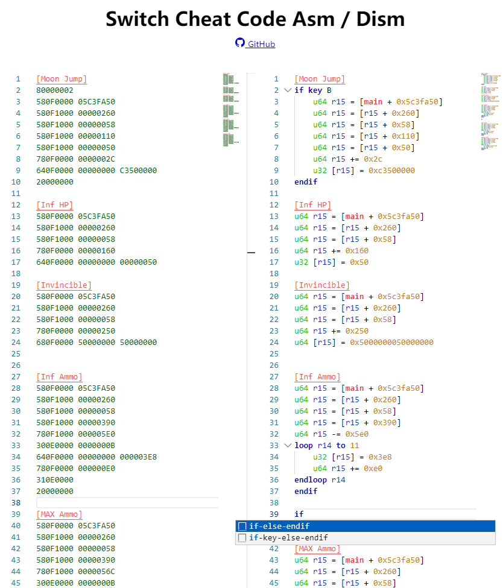

# NxDmntASM

Dead Simple Assembler/Disassembler for Atmosphere dmnt Cheat VM.

## [Online Demo](https://nx.tot.im/)


## Start Local Server
```bash
pip3 install flask
python3 server/app.py
```

## Example



## Cheat VM

The Cheat VM is a virtual machine that provides a set of registers and save slots for executing instructions. It supports various operations and data types, but does not include division or floating-point capabilities.

### Glossary

- `reg`: Virtual machine register.
- `mem`: Game process memory.
- The Cheat VM does not involve real registers, and it does not have its own memory space.
- `value`: Immediate value.
- `off` or `offset`: Offset immediate value.
- `offreg`: Offset register.
- `base`: Memory base, which can be one of the following: `main`, `heap`, `alias`, `aslr`.
- `dtype`: Data type, such as u8/u16/u32/u64/i8.../i64/ptr.
- `{ .. }`: Optional.

### Registers and Save Slots

The Cheat VM includes the following components:

- **Registers**: There are 16 general-purpose registers labeled as r0 to r15.
- **Save Slots**: There are 16 save slots labeled as save[0] to save[15].
- **Static Registers**: There are 128 static registers, from 0x00 to 0x7f, which are read-only.
- **Write-Only Static Registers**: There are 128 write-only static registers, from 0x80 to 0xff.

### Syntax

The Cheat VM assembler follows a specific syntax for writing instructions. Here are some important points to keep in mind:

- Each line of code is translated into a single instruction.
- Avoid nesting complex expressions within a single line, as it may not work as expected.
- The assembler does not support variables. You must use the VM registers directly.
- Data types can be omitted, but it is strongly recommended to specify them. By default, the data type is assumed to be u32 (unsigned 32-bit integer).
- The case of the code is not significant; it is case-insensitive.
- Immediate values can be represented in various formats:
  - Hexadecimal: Use the `0x` prefix, followed by the hex value (e.g., `0x1A`).
  - Binary: Use the `0b` prefix, followed by the binary value (e.g., `0b1010`).
  - Octal: Use the `0o` prefix, followed by the octal value (e.g., `0o27`).
  - Decimal: Plain decimal values can be used without any prefix (e.g., `42`).

Feel free to explore the Cheat VM and experiment with its features using the provided syntax and components.

### R/W Memory

The `=` operator indicates a read/write instruction.

You can perform the following operations:
- `reg<->mem`: Transfer data between a register and game process memory.
- `reg<->reg`: Transfer data between two registers.
- `reg<->save`: Transfer data between a register and a save slot.
- `reg<->static`: Transfer data between a register and a static register.

You can also perform the following assignments:
- `reg<-imm`: Assign an immediate value to a register.
- `mem<-imm`: Assign an immediate value to a memory location.
- `save<-0`: Assign the value `0` to a save slot.

To dereference memory, use `[ .. ]`. The usage and limitations are the same as in other assembly languages.

Note: You cannot transfer data directly between two memory locations (`mem<->mem`) in a single line.

You can add an offset immediate value or an offset register to registers or memory locations while performing read/write operations.

For fully detailed syntax rules, please refer to the section below.

```bash
# mem<-imm
{dtype} [base + rN {+offset}] = value
    where:
        offset <= 0xFFFFFFFFFF
        dtype: default = u32
    example:
        i8 [maIn + r2 + 0x100] = -1

# reg<-imm
rN = value  # always 64-bit

# reg<-mem
{dtype} rN = [base {+offset}]
{dtype} rN = [rN {+ offset}]  # Note: {dtype} rA = [rB + offset] is unsupported

# mem<-imm
{dtype} [rM{++} {+rN}] = value
    where:
        rM++ means rM += width after operation
    example:
        i32 [r0++ + r1] = 0x12345678
        i32 [r0 + r1] = 0x12345678
        i32 [r0++] = 0x12345678

# reg update (legacy, use next instruction instead)
{dtype} rN OP= value
    where:
        OP is one of +, -, *, <<, >>
    example:
        r0 += 0x12345678

# reg<->reg
{dtype} rD = rS OP value
{dtype} rD = rS OP rs
{dtype} rD = rS
{dtype} rD = ~rS
    where:
        OP is one of +, -, *, <<, >> & | ^

# mem<-reg
{dtype} [rM{++} {+offset {+rN}}] = rS
{dtype} [base + {+offset {+rM{++}}}] = rS
    where:
        rM ++ means rM +=width after operation
    example:
        u32 [r2++] = r5
        u32 [r2++ + 2 + r3] = r4

```

### Control Flow

```bash
#####################
if {dtype} [base {+offset}] COND value {then}
if {dtype} rN COND [base {+offset}] {then}
if {dtype} rN COND [base + rM] {then}
if {dtype} rN COND [rM {+offset}] {then}
if {dtype} rN COND [rBase + rOffset] {then}
if {dtype} rN COND value {then}
if {dtype} rN COND rM {then}
    where:
        COND = >, >=, <, <=, ==, !=
        THEN is optional keyword
else
endif

# other if syntax
# examples
if [main + 0x1234] > 0x1234
else  # optional
endif

#####################

# If keys are pressed
if key KEYNAME|KEYNAME2|...
  # examples of valid keyname
  # A/B/X/Y
  # LSTICK/RSTICK/../LSTICK_UP
  # ZL/ZR/SL/SR
  # PLUS/MINUS
  # UP/DOWN/LEFT/RIGHT
else    # not sure if this works. TIY.
endif


loop rN to COUNT
  # DONT FORGET to specify rN
endloop rN

```

### Other Commands
```bash
# save/restore
save[i] = rN
rN = save[i]
save[i] = 0
rN = 0
    where:
        i is save index, N is reg id
        i < 16 and N < 16
    example:
        save[3] = r3

# batch save/restore
save rA, rB, ..., rN
restore rA, rB, ..., rN
save[i,j,...k] = 0
rA, rB, ..., rN = 0
    where:
        i,..k are save indicies, A,..N are reg ids
    example:
        save r3, r4, r5
        restore r3, r4, r5
        save[3,4,5] = 0
        r0, r1, r2 = 0

# static registers (I don't understand why people use it)
rN = static[i]  # when i < 0x80
static[i] = rN  # when i >= 0x80

# pause the game
pause

# resume the game
resume

# log data to file
log ID {dtype} [base {+offset}]
log ID {dtype} [base + rN]
log ID {dtype} [rM {+offset}]
log ID {dtype} [rM + rN]
log ID {dtype} [rM]
    where:
        0 <= ID <= 0xF

# use it as a placeholder in credit section
nop

```

### Python API
```py
from dmnt_asm.parser import CheatParser
from pathlib import Path
# parse vm code
parser = CheatParser()
content = Path('CHEAT.txt').read_text(encoding='utf-8', errors='backslashreplace')
all_ok = parser.load(content)
print(parser.dism(indent=2))
print(parser.asm(indent=2))

# generate vm code from api
from dmnt_asm.instructions import *
vm_XX().build( ... args ...).asm()
vm_XX().build( ... args ...).dism()
```
